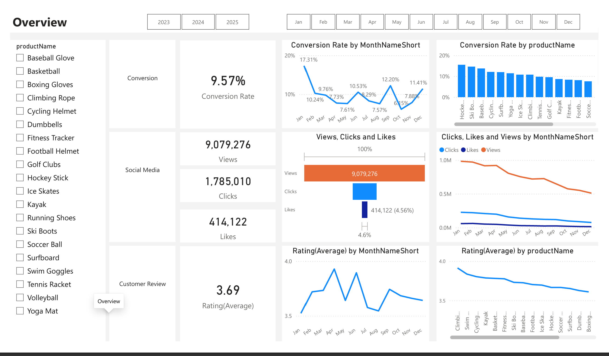
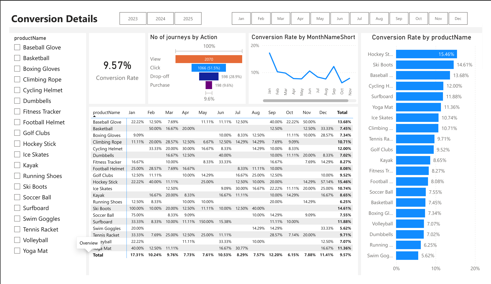
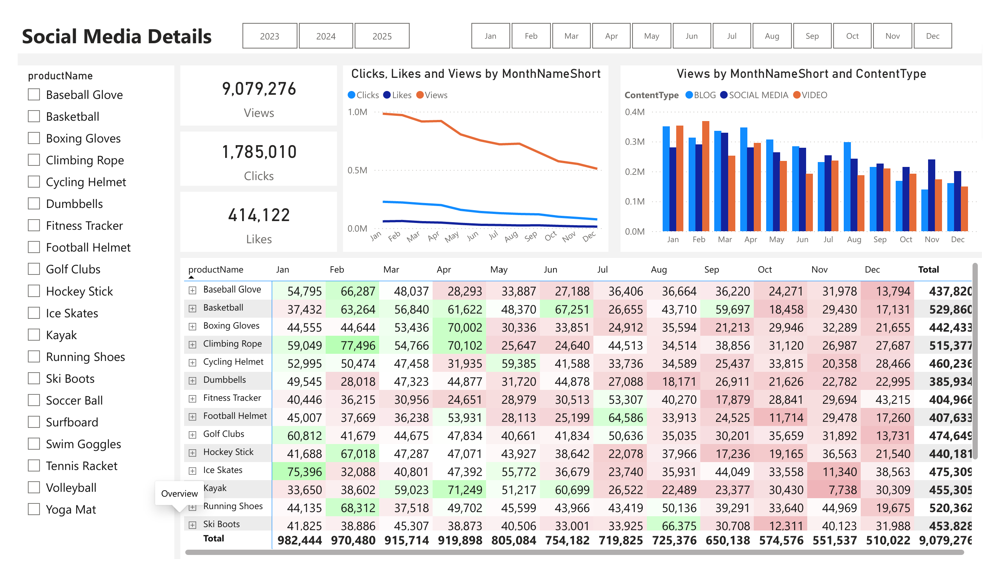
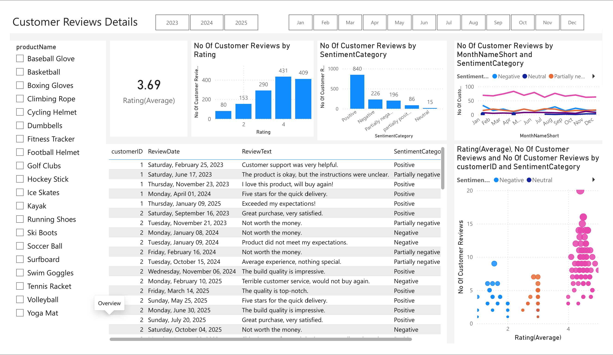

# 📈 Marketing Analytics & Customer Sentiment Analysis

[](YOUR_LOOM_LINK_HERE)
[](Marketing_Analytics_Dashboard.pdf)

## 📌 Project Overview
This project models an enterprise-level Marketing Analytics pipeline. It transforms raw, fragmented customer, product, and campaign data into structured database views, performs Natural Language Processing (NLP) sentiment analysis on customer reviews via Python, models data using a Power BI Star Schema, and delivers interactive executive dashboards.

The goal is to analyze marketing efficiency, customer journey bottlenecks, and product feedback to deliver actionable, ROI-focused business strategies.

---

## 🗂️ Project Repository Structure

```text
marketing-analytics-sentiment-analysis/
│
├── data/                             # Raw & processed datasets
│   ├── raw_customers.csv
│   ├── raw_customer_journey.csv
│   ├── raw_customer_reviews.csv
│   ├── raw_engagement_data.csv
│   ├── raw_geography.csv
│   ├── raw_products.csv
│   └── fact_customer_reviews_with_sentiment.csv  # Output from Python NLP
│
├── sql_scripts/                      # T-SQL Cleaning & View Creation
│   ├── 01_clean_customers.sql
│   ├── 02_clean_products.sql
│   ├── 03_clean_customer_reviews.sql
│   ├── 04_clean_customer_journey.sql
│   └── 05_clean_engagement_data.sql
│
├── python/                           # Python ETL & Sentiment Pipeline
│   └── 06_sentiment_analysis.py
│
├── docs/                             # Documentation & Visual Assets
│   └── screenshots/
│       ├── 01_overview.png
│       ├── 02_conversion_details.png
│       ├── 03_social_media_details.png
│       └── 04_customer_sentiment.png
│
├── Marketing_Analytics_Dashboard.pbix # Interactive Power BI Dashboard
├── Marketing_Analytics_Dashboard.pdf  # Static PDF Export
└── README.md                         # Documentation & Project Guide
```

---

## 🛠️ Database Setup & Restoration

This project relies on a Microsoft SQL Server database. If you wish to restore the full relational database locally from a `.bak` file:

1. Download the database backup file (`PortfolioProject_MarketingAnalytics.bak`).
2. Place the file in your SQL Server backup directory (e.g., `C:\Program Files\Microsoft SQL Server\MSSQL16.SQLEXPRESS\MSSQL\Backup\`).
3. Execute the following T-SQL script in SQL Server / VS Code to restore the database:

```sql
-- Restore Database from Backup File
RESTORE DATABASE PortfolioProject_MarketingAnalytics
FROM DISK = 'C:\Program Files\Microsoft SQL Server\MSSQL16.SQLEXPRESS\MSSQL\Backup\PortfolioProject_MarketingAnalytics.bak'
WITH REPLACE,
MOVE 'PortfolioProject_MarketingAnalytics' TO 'C:\Program Files\Microsoft SQL Server\MSSQL16.SQLEXPRESS\MSSQL\DATA\PortfolioProject_MarketingAnalytics.mdf',
MOVE 'PortfolioProject_MarketingAnalytics_log' TO 'C:\Program Files\Microsoft SQL Server\MSSQL16.SQLEXPRESS\MSSQL\DATA\PortfolioProject_MarketingAnalytics_log.ldf';
```

---

## 🧹 Phase 1: SQL Data Cleaning & Transformation Layer

To ensure efficient staging and downstream analysis, raw database tables were cleaned and converted into modular database views (`dbo.vw_*`).

### Key SQL Logic Implemented:
* **`dbo.vw_dim_customers`**: Joined `dbo.customers` with `dbo.geography` to add spatial context to customer profiles.
* **`dbo.vw_dim_products`**: Cleaned and formatted product dimensions and pricing tiers.
* **`dbo.vw_fact_customer_reviews`**: Staged review text data for downstream Python Natural Language Processing (NLP).
* **`dbo.vw_fact_customer_journey`**: 
  * Implemented `ROW_NUMBER() OVER(PARTITION BY ...)` to identify and remove duplicate journey records.
  * Used `COALESCE()` combined with window functions (`AVG(Duration) OVER(PARTITION BY VisitDate)`) to impute missing visit durations.
* **`dbo.vw_fact_engagement_data`**: 
  * Cleaned inconsistent string values (e.g., `SocialMedia` → `Social Media`).
  * Used string manipulation (`LEFT`, `RIGHT`, `CHARINDEX`, `LEN`) to split single concatenated columns into separate `Views` and `Clicks` numeric metrics.
  * Formatted dates into standard `dd.MM.yyyy` string formats and filtered out non-essential content types.

---

## 🐍 Phase 2: Python Natural Language Processing (NLP)

To extract structured insights from unstructured customer review text, a Python pipeline was created using **NLTK (VADER)** and **Pandas**.

### Technical Highlights:
* **Database Connection:** Used `pyodbc` to query `dbo.vw_fact_customer_reviews` directly from Microsoft SQL Server into a Pandas DataFrame.
* **VADER Sentiment Analysis:** Calculated a continuous normalized compound score (ranging from `-1.0` to `+1.0`) for every review text string.
* **Hybrid Classification Logic:** Combined text sentiment scores with numerical star ratings (`1–5`) to handle edge cases like sarcasm.
* **Dimensional Bucketing:** Segmented continuous compound scores into categorical ranges (`0.5 to 1.0`, `0.0 to 0.49`, `-0.49 to 0.0`, `-1.0 to -0.5`) to allow dynamic filtering in Power BI.
* **Data Export:** Exported the enriched dataset to `fact_customer_reviews_with_sentiment.csv`.

---

## 📊 Phase 3: Power BI Data Modeling & Visualization

A 4-page interactive dashboard was constructed using Star Schema dimensional modeling, custom DAX measures, and advanced visualization techniques.

### Data Architecture (Star Schema)
```text
                 ┌───────────────────────┐
                 │    dim_customers      │
                 └───────────┬───────────┘
                             │ (1:N)
                             ▼
┌─────────────────┐     ┌─────────────────────────┐     ┌──────────────────┐
│   dim_products  ├────►│  fact_customer_journey  │◄────┤     dim_date     │
└────────┬────────┘ (1:N)└─────────────────────────┘(1:N)└────────┬─────────┘
         │                                                         │
         │ (1:N)                                             (1:N) │
         ▼                                                         ▼
┌─────────────────────────┐                             ┌──────────────────┐
│  fact_customer_reviews  │                             │  fact_engagement │
└─────────────────────────┘                             └──────────────────┘
```

### Key DAX Formulas Implemented:

* **Conversion Rate:**
  ```dax
  Conversion Rate = 
  DIVIDE(
      CALCULATE(COUNT(fact_customer_journey[JourneyID]), fact_customer_journey[Action] = "Purchase"),
      CALCULATE(COUNT(fact_customer_journey[JourneyID]), fact_customer_journey[Action] = "View"),
      0
  )
  ```

* **Funnel Drop-off Rate:**
  ```dax
  Drop-off Rate = 
  DIVIDE(
      CALCULATE(COUNT(fact_customer_journey[JourneyID]), fact_customer_journey[Action] = "Drop-off"),
      CALCULATE(COUNT(fact_customer_journey[JourneyID]), fact_customer_journey[Action] = "Click"),
      0
  )
  ```

* **Click-Through-Rate (CTR):**
  ```dax
  CTR = DIVIDE(SUM(fact_engagement[Clicks]), SUM(fact_engagement[Views]), 0)
  ```

---

## 💡 Phase 4: Key Business Insights

### 1. Marketing Funnel Performance
* **Overall Campaign Conversion:** The end-to-end conversion rate across all product lines sits at **9.57%** (198 purchases out of 2,070 views).
* **Funnel Bottleneck:** A significant revenue loss occurs between the `Click` stage (51.5% of total views) and final purchase, where **28.9% (598 visits) drop off completely**.
* **Product Disparities:** 
  * **Top Performers:** `Hockey Stick` (**15.46%** conversion) and `Ski Boots` (**14.61%** conversion).
  * **Underperformers:** `Swim Goggles` (**5.62%** conversion) and `Running Shoes` (**6.25%** conversion).

### 2. Campaign Reach & Engagement Trends
* **Reach Decay:** Impression views dropped steadily over the 12-month period, declining from **982K views in January** down to **510K views in December** (a ~48% reduction in organic reach).
* **Engagement Totals:** Total campaign reach logged **9.08M Views**, **1.79M Clicks** (~19.6% CTR), and **414K Likes** (~23.2% Click-to-Like conversion).

### 3. Customer Sentiment Analysis
* **Overall Rating Baseline:** The product catalog maintains an average review score of **3.69 / 5.0**.
* **Sentiment Breakdown:** Out of 1,750 recorded reviews, **840 are Positive**, while **422 reviews are classified as Negative or Partially Negative**. Text analysis indicates negative scores are primarily driven by shipping SLAs and packaging rather than core product functionality.

---

## 🎯 Phase 5: Strategic Business Recommendations

1. **Address Funnel Drop-offs:** Audit the checkout flow for lower-converting categories like `Swim Goggles` and `Running Shoes` to capture abandoned purchase-intent traffic.
2. **Reallocate Marketing Capital:** Shift budget away from broad top-of-funnel impression tactics and reallocate towards high-converting product categories (`Hockey Stick`, `Ski Boots`, `Baseball Gloves`).
3. **Resolve Operational Shipping SLAs:** Partner with logistics teams to resolve delivery delays highlighted in negative text reviews, directly protecting customer retention rates.

---

## 🖼️ Dashboard Screenshots

### Page 1: Executive Overview


### Page 2: Conversion Details & Funnel Analysis


### Page 3: Social Media Performance


### Page 4: Customer Reviews & Sentiment Analysis


---

## ⚙️ How to Reproduce This Project

1. **Database Setup:** Run scripts `sql_scripts/01_*` through `sql_scripts/05_*` in Microsoft SQL Server to create clean views (`dbo.vw_*`).
2. **Python NLP Execution:** Execute `python/06_sentiment_analysis.py` to generate the enriched `fact_customer_reviews_with_sentiment.csv` file.
3. **Power BI Reporting:** Open `Marketing_Analytics_Dashboard.pbix` in Power BI Desktop to inspect the Star Schema, DAX metrics, and dashboard visuals.